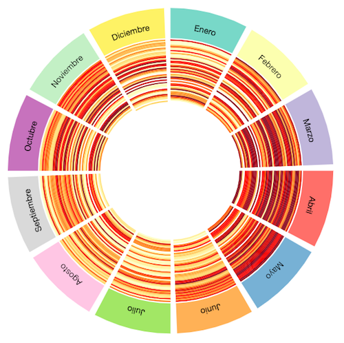

# Bogota Seasons

As a part of the Visual Analytics course at Universidad de los Andes, I have taken the [average temperature](https://www.datos.gov.co/Ambiente-y-Desarrollo-Sostenible/Temperaturas-Medias/6te7-njc8) of Bogotá month by month from the last 50 years and their [precipitation total](https://www.datos.gov.co/Ambiente-y-Desarrollo-Sostenible/Precipitaciones-Totales-Mensuales/mb4n-6m2g) from [*Datos Abiertos*](https://www.datos.gov.co). Making use of the [CircosJS](https://github.com/nicgirault/circosJS) vis library, I have made this visualization to try to understand the seasonal patterns Bogotá may have as a tropical city located near to the Equator.

You can see the demo running [here](https://ss1993.github.io/bogota_seasons/).

**Note**: The color legend represents how hot or cold was a given month in its year. Thus, it can not be used to compare across different years.
